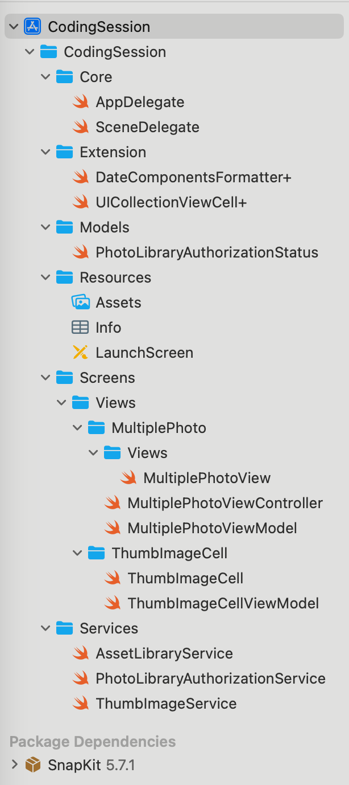

# SampleUIKit
A sample project that uses UIKit and the MVVM architecture.

## Demo screen record

## Implementation Details
- For binding between the ViewModel and the View, I used a modern approach based on Swift Standard Library Concurrency.
- Video asset loading is performed with high priority and does not block the main thread.
- The creation and display of previews also do not block the main thread.

## Project structure

## License
Copyright huynguyencong,  Licensed under the MIT license.

